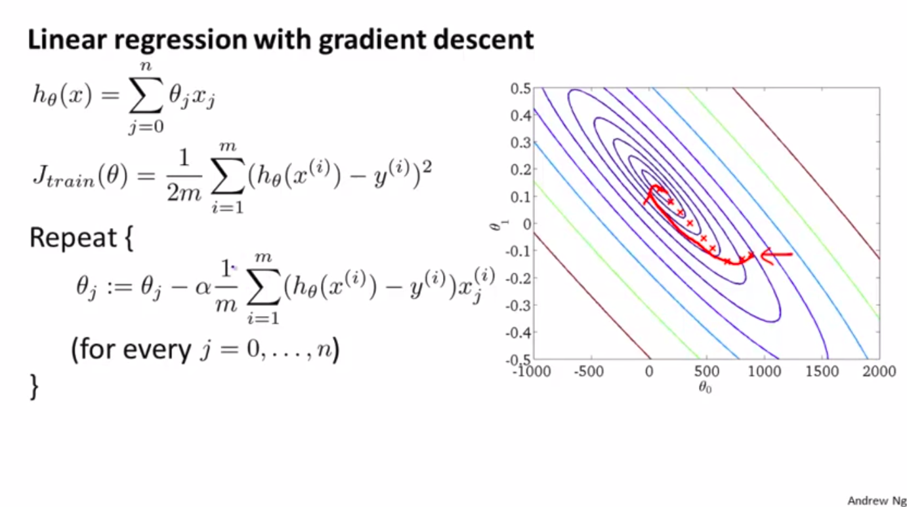
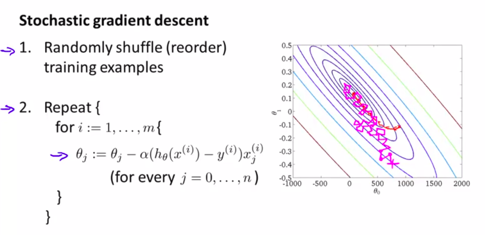

# Gradient Descent

## Linear regression

$$ h_{\theta}(x) = \sum_{j=0}^{n} \theta_{j}x_{j} $$

$$ J_{train}(\theta) = \frac{1}{2m} \sum_{i=1}^{m}(h_{\theta}(x^{(i)}) - y^{(i)})^{2} $$

$$
Repeat : (
\\
\theta_{j} := \theta_{j} - \alpha \frac{1}{m} \sum_{i=1}^{m}(h_{\theta}(x^{(i)}) - y^{(i)})x_{j}^{(i)}
\\
(for \enspace every \enspace j=0,...,n)
\\
)
$$

# Stochastic Gradient Descent

## summarizing

### Advantage / Disadvantage
1. TODO ...

### Last words
1. Gradient Descent (and other optimization algorithm) always trying to minimize the cost function (MSE, RMSE, etc.).
2. Gradient Descent good for small number of data.
3. Stochastic Gradient Descent don't reach the real minimum of cost function, just walking around in very near area of minimum.

## Resources

### 1-web
1. [[1.1.] Gradient Descent in Python](https://towardsdatascience.com/gradient-descent-in-python-a0d07285742f)
    1. [GitHub](https://gist.github.com/sagarmainkar/41d135a04d7d3bc4098f0664fe20cf3c)
2. [[1.2.] Stochastic Gradient Descent](http://d2l.ai/chapter_optimization/sgd.html)
3. [[1.3.] Stochastic Gradient Descent & Momentum Explanation](https://towardsdatascience.com/stochastic-gradient-descent-momentum-explanation-8548a1cd264e)
    1. [GitHub](https://github.com/MJeremy2017/Machine-Learning-Models/blob/master/Optimisation/gradient-descent.ipynb)

# 📝 NOTES | TODO ...
1. TODO ... 