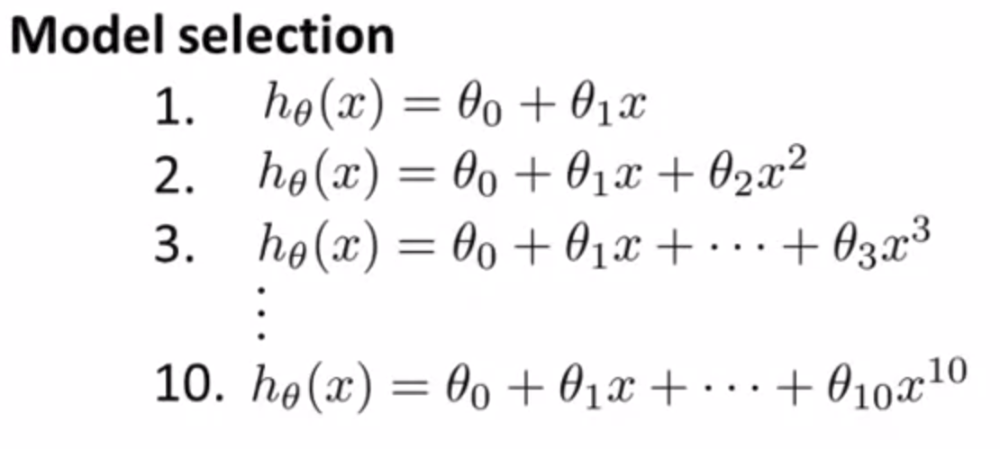
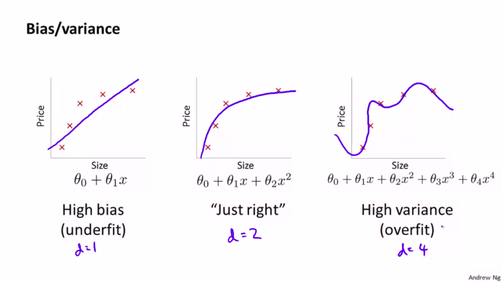
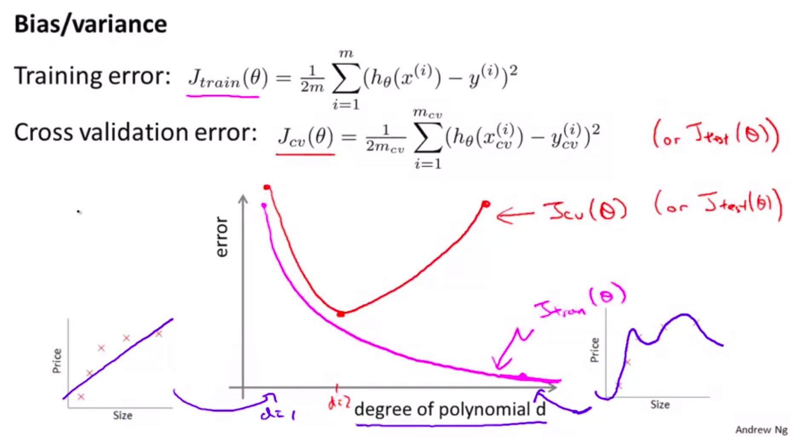
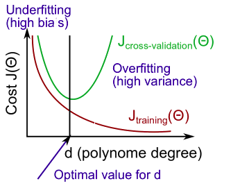

# Advice for Applying Machine Learning (Week6)
suppose we have a linear regression for predicting house pricing, and we test model on a new data, but the model makes a lot of errors in its prediction, some solution which come to mind :

1. Add more training data, ```Some times adding more training data is not good solution why?```.
    1. when we want to add more data may it take a lot of time or it's impossible.
2. Try smaller sets of features, or choose carefully and selectively this features.
3. Try getting additional features.
    1. it's nice to know in advance if this well help, befor star doing this solution.
4. Try add polynomial features (x1^2, x2^2, x1x2, etc.).
5. Try decreasing increasing lambda, regulazation parameter.

This solutions can take a lot of months to implement it, or some time people choose one of this solutions randomly. Which all of this is bad decision. There are some technique that can tel you very quickly if some point of the list above has promising results. Which it mean saveing a lot of time.


## Evaluate machine learning algorithem

When we train ML model (fitting) by minimizing the cost function, and getinggeting low training error, as we see in the (figure 1) below, the question is that good ? if our model is intelligent now ? is that we are looking for ? The answer is ```No``` it doesn't mean the model (hypothesis) is good necessarily, it's not good because we will get overfitting, as we see in the plot of the hypothesis below, what it mean the model will not be able to generalize new data and make good prediction on new data.

###### Fig. 1. exmaple of overfitting


Now we know we don't want just to minimize the cost function (getting low value of training error), we want also to avoid the overfitting, but how to know when model start overfit the training data, especially when we have a lot of features in training data where we can't plot the hypothesis. the simplest way to evaluate the model (checking if there are overfitting) divide the data into two sets first one will be training set and the second test set, the portions of dividing is 70/30 which it mean the training set well have 70% of data and the test set 30%. ```keep in mind to randomly shuffle the data before splitting into train/test set```


Training/Testing procedure for linear regression : 
+ Learn parameter θ from training data (minimizing training error J(θ)).
+ Compute test set error.
    - TODO write the formula


Training/Testing procedure for linear regression : 
+ Learn parameter θ from training data (minimizing training error J(θ)).
+ Compute test set error.
    - TODO write the formula


## Model selection

How choose the best model ? or how to choose the good lambda parameter for regularization ? this case we call a model selection process. to explain this process let's consider this example, suppose we have a different polynomial suggested to solve some problem, so which one to choose how decide which one is good ?

###### Fig. 2. different polynomials



TODO ... talk why train/test is not good way to selected the model, and how the model will fit the test set also make example of model selection using some code ....

make difrent models with difrent polynomial degree (d), make train/validation set/test sets, train then validation set, pick the best an then test this one. estimate generalization error for test set


```Model Selection and Train/Validation/Test Sets``` (COURSERA)

Just because a learning algorithm fits a training set well, that does not mean it is a good hypothesis. It could over fit and as a result your predictions on the test set would be poor. The error of your hypothesis as measured on the data set with which you trained the parameters will be lower than the error on any other data set.

Given many models with different polynomial degrees, we can use a systematic approach to identify the 'best' function. In order to choose the model of your hypothesis, you can test each degree of polynomial and look at the error result.

One way to break down our dataset into the three sets is:

+ Training set: 60%
+ Cross validation set: 20%
+ Test set: 20%

We can now calculate three separate error values for the three different sets using the following method:

+ Optimize the parameters in Θ using the training set for each polynomial degree.
+ Find the polynomial degree d with the least error using the cross validation set.
+ Estimate the generalization error using the test set with Jtest(Θ(d)), (d = theta from polynomial with lower error);

This way, the degree of the polynomial d has not been trained using the test set.


# Machine learning diagostic

If you run the learning algorithm and it doesn't work as you expect, so probably the model (learning algorithem) suffering from bias/variance problem, maybe you model have high bias or high variance or both, what that mean underfitting or overfitting to figure this problem we use different technique we will talk about it right now.


## Diagnosing Bias vs. Variance

Understanding and figur bias, varians problem or both in another word underfitting or overfitting. figure this problems help us to choce the good ways to improve the ML Algo. in Fig. 3. we see three different plots the first one from the left we see a high bias problem (underfitting) where the hypothesis didn't fit the training data very well, the next plot in the middle  the prefect case for the hypothesis just we want that, ths last plot we see the hypothesis has a high variance (overfitting) we see the hypothesis fit super perfectly the training data where the model will not be able to work well on new data for ex. with the test data. 


##### Fig. 3. bias-variance



How we will detect the bias/variance problem in context of polynomial degree, we can make different models everyone has different degree then plot the train/validation error of every model like below

##### Fig. 4. bias/variance with different polynomial degree


As we see in (Fig. 4.) the model with low degree for ex. d=1 has a big error on the train data also on the validation data thats mean hiegh bias problem (underfitin), in another hand the model with big degree for ex. d=5 the train error is very low the hypothesis fit the train data perfectly but on the Validation data the validation error is big so that mean a hiegh variance problem (overfitting).

##### Fig. 5. bias/variance side effect



Bias (Underfit) - The training set error will be hiegh, and the validation set alos will be hiegh.

Variance (Overfit) - The traing set error will be low, and the validation set error will be hiegh even much biger than training set error.


TODODODODODDODODO