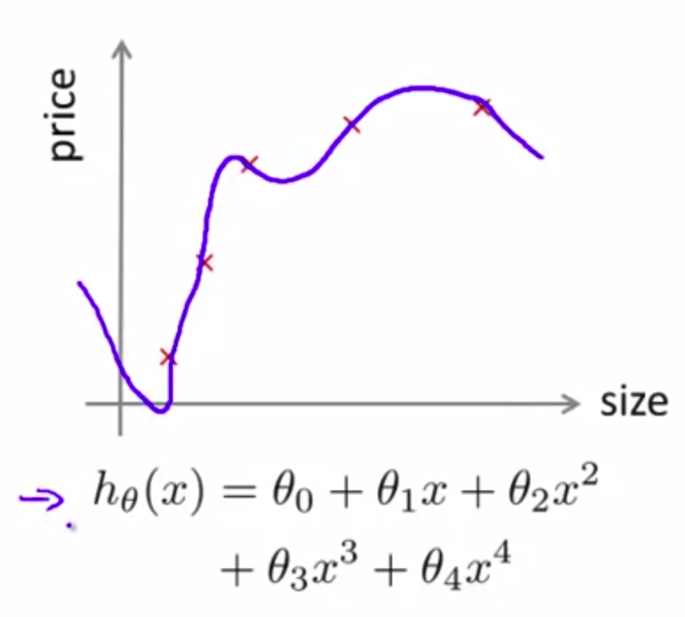

# Advice for Applying Machine Learning (Week6)
suppose we have a linear regression for predicting house pricing, and we test model on a new data, but the model makes a lot of errors in its prediction, some solution which come to mind :

1. Add more training data, ```Some times adding more training data is not good solution why?```.
    1. when we want to add more data may it take a lot of time or it's impossible.
2. Try smaller sets of features, or choose carefully and selectively this features.
3. Try getting additional features.
    1. it's nice to know in advance if this well help, befor star doing this solution.
4. Try add polynomial features (x1^2, x2^2, x1x2, etc.).
5. Try decreasing increasing lambda, regulazation parameter.

This solutions can take a lot of months to implement it, or some time people choose one of this solutions randomly. Which all of this is bad decision. There are some technique that can tel you very quickly if some point of the list above has promising results. Which it mean saveing a lot of time.


## Evaluate machine learning algorithem

When we train ML model (fitting) by minimizing the cost function, and getinggeting low training error, as we see in the (figure 1) below, the question is that good ? if our model is intelligent now ? is that we are looking for ? The answer is ```No``` it doesn't mean the model (hypothesis) is good necessarily, it's not good because we will get overfitting, as we see in the plot of the hypothesis below, what it mean the model will not be able to generalize new data and make good prediction on new data.

###### Fig. 1. exmaple of overfitting



Now we know we don't want just to minimize the cost function (getting low value of training error), we want also to avoid the overfitting, but how to know when model start overfit the training data, especially when we have a lot of features in training data where we can't plot the hypothesis. the simplest way to evaluate the model (checking if there are overfitting) divide the data into two sets first one will be training set and the second test set, the portions of dividing is 70/30 which it mean the training set well have 70% of data and the test set 30%. ```keep in mind to randomly shuffle the data before splitting into train/test set```


Training/Testing procedure for linear regression : 
+ Learn parameter θ from training data (minimizing training error J(θ)).
+ Compute test set error.
    - TODO write the formula


Training/Testing procedure for linear regression : 
+ Learn parameter θ from training data (minimizing training error J(θ)).
+ Compute test set error.
    - TODO write the formula


