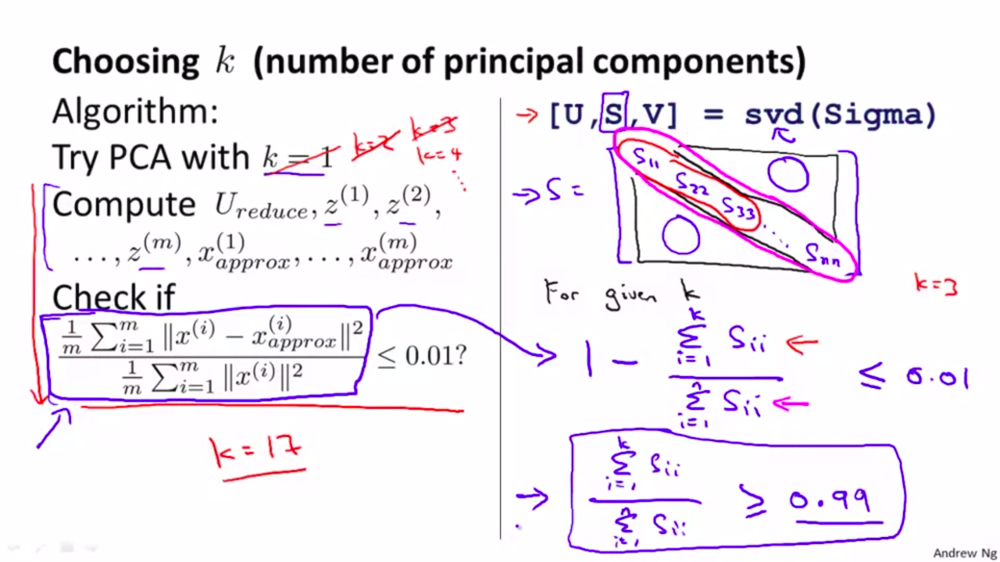

# Unsupervised Learning (Week8)
Unsupervised learning algorithm, are different by many points from supervised algorithm, as we mentioned in previous sections when we say that supervised learning algorithm learn from samples labeled by class (or classified), so technical we are telling the algo.  every sample how should be classified by the algo. (what's the desired outputs), in another hand unsupervised algo. don't have the information about the labels we don't add the class information about every sample, because we want unsupervised algo. to group every samples in appropriate classes as good as they can. So this algo. have to find patterns, structure to match (put) every sample in the best group (class, label) by them self of course based on good solid mathematical techniques 😅.

## Topics
Unsupervised learning algorithm is used for clustering data (samples), for ex. in marketing segmentation, social network analysis etc.

Data Compression used for many reason to use less computer memeory, dimension reduction of features, speed the learning time of ML models, thanks for dimensionality reduction, we able to plot the data in 2D ot 3D.

### clustering
Clustering is group unlabelled dataset into coherent subset (clusters), one of the most used algo. for this is k-nearest neighbor.


#### K-means Algorithm

##### Implementation K-means

1. **start**

```
Input:
    - K (number of clusters).
    - Training set {x^{(1)}, x^{(2)}, ..., x^{(m)}}

x^{(i)} ∈ R^n (drop x_0 = 1)
```

2. **K-means algo.**

```
Randomly initilize K clusers centroids μ_1, μ_2, ..., μ_K ∈ R^n

repeat {
    for i = 1 to m
        c^{(i)} := index (from 1 to K) of cluster centroid closest to x^{(i)}, in this point minimizing the objective function min J(c_(1), ..., c_(m) ,μ_1, ..., μ_k).

    for k = 1 to K
        μ_k := average (mean) of points assigned to cluster k.
}
```

+ Randomly initialize the K number of clusters should be less than m number of samples (K < m), and then pick K trainig examples, set μ_1, ..., μ_k equal to this K examples. This way help us to avoid sticking in local minimum (optima).

+ Choosing the Number of Clusters, actually there are no official way to that, must come one solutions doing that by hande, looking at the data visualisation,  arbitrarily some people say to use the elbow method 💪 but sometimes it doesn't work some situations as we see below so still you have to try and test. SOmetimes you want to do market segmentation and you want just 3 clusters so you go with that sometimes you want 5 clusters so you go with that. generally is based on purpose of your project may  other steps or process will give you good clue.


Suppose you run k-means using k = 3 and k = 5. You find that the cost function J is much higher for k = 5 than for k = 3. What can you conclude?

In the run with k = 5, k-means got stuck in a bad local minimum. we should try re-running k-means with multiple random initializations. **`ADDING MORE CLUSTERS WE GET MORE LOWER VALUE FOR COST FUNCTION J(...) ALWAYS?`**


##### What to do ?

Sometimes we get non-separated clusters (not obvious separated), like the figure below. so what to do ? like the exmaple below we have the T-shirt size we can separate them into three groups (S, M, L), and the K-means will separate...


If K-means stuck in local minimum (optima) like figure below, a good way to fix that is to a randomly initialize K-means again, if think or see that the K-means stuck and stuck again we can use this solution to run initialization lots of time like the algo. below

```
for i = 1 to 100 {
    - Randomly initialize KKN.
    - Run K-means.
    - Get c_(1), ..., c_(m) ,μ_1, ..., μ_k
    - Compute cost function (distorition) J(c_(1), ..., c_(m) ,μ_1, ..., μ_k)
}

At the end pick the best  K-means wich give you the lowest value of cost function J(...)
```


##### Extra info

> Suppose we have k-means and after the algorithm converges, we get: c^{(1)}=3, c^{(2)}=3, c^{(3)}=5, c(1)=3, c(2)=3, c(3)=5,…
>
> we can say Out of all the possible values of k∈{1,2,…,K} the value k=3 minimizes ∥x(2)−μ_k∥^2.
>


> If you run lots of time to find the best K-means algo. by making random initialization that's ok, specifically of doing that in regime 2-10 clusters
> you will see a huge progress, but in case you run that in regime 100 clusters, yes you will see some progress but not that much as you expecting and even you will get a decent solution at first initialization (maybe yes / maybe no), at the end just keep that in mind 😉.
>

### Data Compression
One of use of data compression is reduce the dimensionality reduction (especially the features) for ex. from 3D to 2D like below


#### Principal Component Analysis PCA

one of most common algo. to reduce the dimensionality, PCA in context of reducing from 2D to 1D, try to find the best direction (a vector $u^(i) \in R^n$) onto whcih to project the data so as minimize the projection error. in context of reducing from n-dimension to k-dimension, PCA try to find $k$ vectors $u^(1), u^(2), ..., u^(k)$ onto whcih to project data, so as minimize the projection error.


##### Implementation PCA

preprocessing(feature )  if feature in different scale

$\mu_j = \frac{1}{m} \sum_{i=1}^{m} x_{j}^{(i)}$

TODO ....


Choosing number of $k$ (number of principal components) :
Average squared projection error : $\frac{1}{m} \sum_{i=1}^{m} \| x^{(i)} - x^{(i)}_{approx} \|^2$

Totoal variation in the data : $\frac{1}{m} \sum_{i=1}^{m} \| x^{(i)} \|^2$

Typically, choose $k$ to be smallest value so that

$\frac{\frac{1}{m} \sum_{i=1}^{m} \| x^{(i)} - x^{(i)}_{approx} \|^2}{\frac{1}{m} \sum_{i=1}^{m} \| x^{(i)} \|^2} \leq 0.01 (1%)$

`Choose k to be the smallest value so that at least 99% of the variance is retained.`




##### PCA BACK
TODO ...


##### Extra info

First difference linear regression is a supervised learning algo. while the PCA is unsupervised algo. which it mean linear regression use all x-es to predict value of y while the PCA don't predict there is no y even. in linear regression all inputs (features) $x_1, x_2, ..., x_n$  are treated equally no one special.


The linear regression will try to predict some value so will draw a straight line where **```minimizing the squared magnitude```** of blue lines (blue lines are in left of the plot below) the blue line is drawn vertically to hypothesis of linear regression ```notice the blue line is drew vertically to hypothesis of linear regression```  which are the vertical distance between the points x and value predicted by the hypothesis.

The PCA try to **```minimize the magnitude```** of blue lines (blue lines are in right of the plot below), ```notice blue lines are drawn at an angle``` which are the shortest distance between the points x and this red line.


We can use PCA to reduce dimension of images TODO ....


``Note``, Mapping $x^{(i)} \rarr z^{(i)}$ should be defined by running PCA **``only on the training set``**. This mapping can be applied as well to the examples of $x_{cv}^{(i)}$ and $x_{test}^{(i)}$ in the cross validation and the test sets.  **`THE QUESTION WHY JSUT ONLY ON TRAIN SET?`** because what would we do on new data never seen before


```PCA is not a good way to prevent overfitting``` (because they reduceing the dimensionality), this not recommended at all. Better to use regularization to prevent overfitting, Why ? if we look what PCA does it's throws a way some information reduceing the dimension of data wihtout knowing the value of $y$ (outputs value, the labels)


## Summarizing


### Advantage / Disadvantage

1. plus it's easy
2. TODO ...

### 📝 NOTES ...

1. In unsupervised learning, you are given an unlabeled dataset and are asked to find "structure" in the data.
2. Clustering is an example of unsupervised learning.
3. Once the KKN algo. find the best psotion for cluster centroids, so it will stop and will not make any change further for the postions [[1.1.]](#1-video-coursera), keep in mind sometimes it could be the best solution because could the K-means stuck in some  local minimum, or the task is complex etc.
4. Sometimes one cluster centroid could end up with no sample (no points assigned to him) so we remove this cluster and we get K - 1 cluster, in case you really want K clusters just randomly initilize the cluster centroid.
5. In Fig. [[Fig.2]](#Fig.2) it is not possible for the cost function of K-means to sometimes increase. There must be a bug in the code [[1.2.]](#1-video-coursera).
6. A good way to initialize K-means is to select K (distinct) examples from the training set and set the cluster centroids equal to these selected examples. This is the recommended method of initialization.

7. On every iteration of K-means, the cost function J(c^{(1)}, ..., c^{(m)},  μ_1, ..., μ_k)J(c_(1), ..., c_(m) ,μ_1, ..., μ_k) (the distortion function) should either stay the same or decrease; in particular, it should not increase. Both the cluster assignment and cluster update steps decrese the cost / distortion function, so it should never increase after an iteration of K-means

8. PCA is not linear regression.

9. Application of PCA
    1. compression by reduceing memeory/disk needed to store data.
    2. speed up learning algorithm.
    3. visualisation 2D/3D.

10. PCA is not a good way to prevent overfitting (because they reduceing the dimensionality), this not recommended at all. PCA is used to speed up the the learning algorithm [[1.3.]](1-video-coursera).


#### Fig.2


## Resources

### 1-video-coursera
1. [[1.1.] week8 > K-Means Algorithm (2:53 s.) ](https://www.coursera.org/learn/machine-learning/lecture/93VPG/k-means-algorithm)
2. [[1.2.] week8 > Optimization Objective (6:23 s.) ](https://www.coursera.org/learn/machine-learning/lecture/93VPG/k-means-algorithm)
3. [[1.3.] week8 > Advice for Applying PCA](https://www.coursera.org/learn/machine-learning/lecture/RBqQl/advice-for-applying-pca)


# TODO ...

1. ADDING MORE CLUSTERS WE GET MORE LOWER VALUE FOR COST FUNCTION J(...) always?

2. If we reduce the dimension of the features do we lose important informations or relations?
yes because they don't know what the value of y [week8 > Advice for Applying PCA](https://www.coursera.org/learn/machine-learning/lecture/RBqQl/advice-for-applying-pca), PCA it's throws a way some information